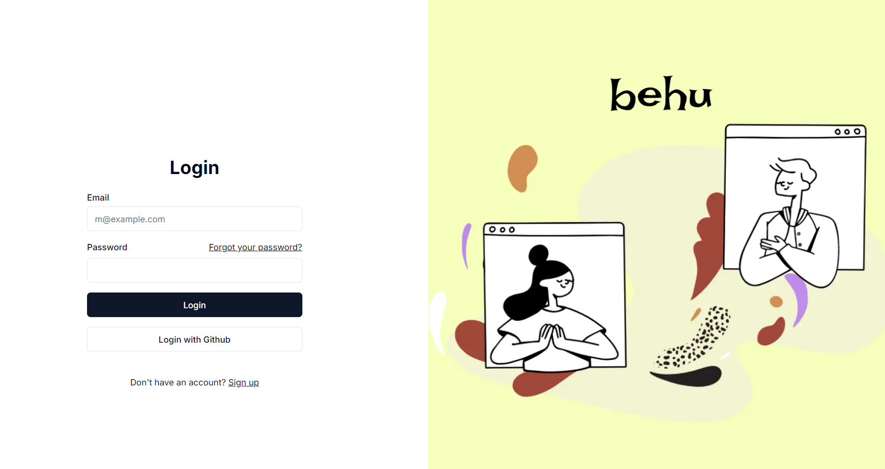
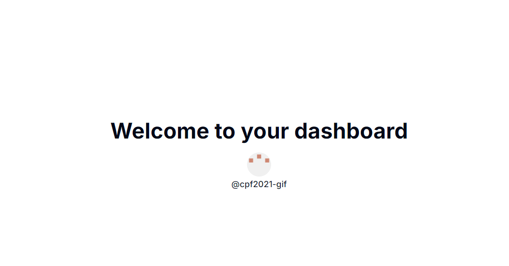

# Behu-web
## Usage
0. replace the `client_id` in `./components/GithubLoginButtion.tsx`
```typescript
'use client';

import { Button } from "@/components/ui/button"

export function GithubLoginButton() {
    return (
        <Button
            onClick={() => {
                // replace the client_id with your own
                window.location.href = "https://github.com/login/oauth/authorize?client_id=Ov23ctUw3Kr2Lfyl6E6S&scope=read:user%20user:email"}
            }
            variant="outline"
            className="w-full">
            Login with Github
        </Button>
    )
}
```     

1. Install dependencies
```bash
pnpm install
```
2. Start the development server
```bash
pnpm dev
```
## Screenshots
### 1. home page

### 2. user  [temporary]

